 

  <a href="https://github.com/Elijah-Prisyazhnyuk/Conference">
    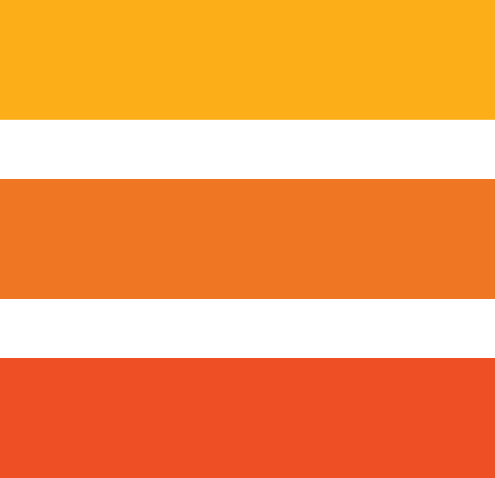
  </a>

  <h3 align="center">59-ая Научно-техническая конференция молодых специалистов Дивизиона Сибирь "Твой вызов"</h3>

  

    Презентация с конференции
     
     
    <a href="https://github.com/Elijah-Prisyazhnyuk/conference/raw/main/preza_dlya_finala.pptx"><strong>Скачать презентацию »</strong></a>
     
  

 

## Содержание

* [О Конференции](#about-the-conference)
* [Проблематика](#problema)
* [Решение 1](#solution-1)
  * [Решение 1 Моделирование](#solution-1-modeling)
* [Решение 2](#solution-2)
  * [Решение 2 Моделирование](#solution-2-modeling)
* [Решение 3](#solution-3)
* [Решение 4](#solution-4)
* [Решение 5](#solution-5)
* [Авторы](#authors)
* [Acknowledgements](#acknowledgements)

## О Конференции

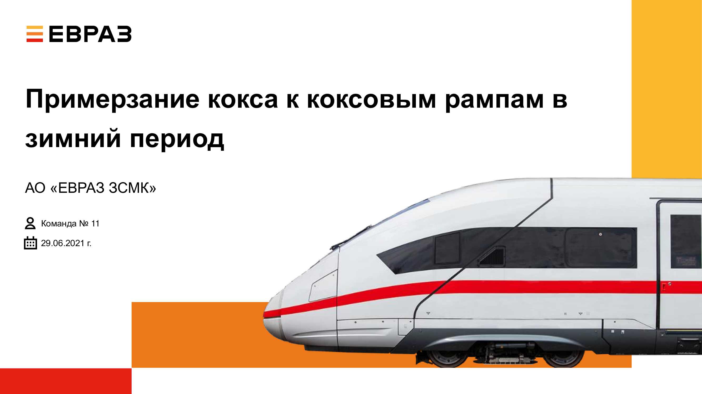

Это было сложное, но очень интересное и практическое соревнование в два тура. Первый тур был посвящен "Охоте за рисками", а второй включал решение практической технической задачи по замораживанию кокса на коксовой рампе. Научно-техническая конференция длилась несколько месяцев, и благодаря слаженной командной работе наша группа смогла выиграть приз и достичь поставленных целей. Мой вклад в работу команды включал математическое моделирование технических решений с использованием CAD, CFD и FEM-анализа, а также визуальное представление результатов.

## Проблематика

**Сегмент:** КАДС **Цех:** Коксовый

**Проблема/ситуация:**
В зимнее время, при температуре окружающей среды от -20С и ниже, при выдаче протушенного кокса на рампы 1 и 1а, во время выдержки с целью снижения физической влаги и устранения очагов горения кокса происходит его примерзание к плитке в районе краев рампы, рассекателей и затворов. Что привело к снижению объемов производства кокса в зимний период 2020-21гг – 3,99 тыс. тонн (22 млн руб.)

**Задача команды:**
Разработать мероприятия: 
1) по исключению примерзания кокса к рампам 1 и 1а в зимний период;
2) по минимизации возникновения риска потерь производства в следствии снижения ФРВ рамп;

## Решение 1
**Мой вклад** - 3D модель, дизайн слайда
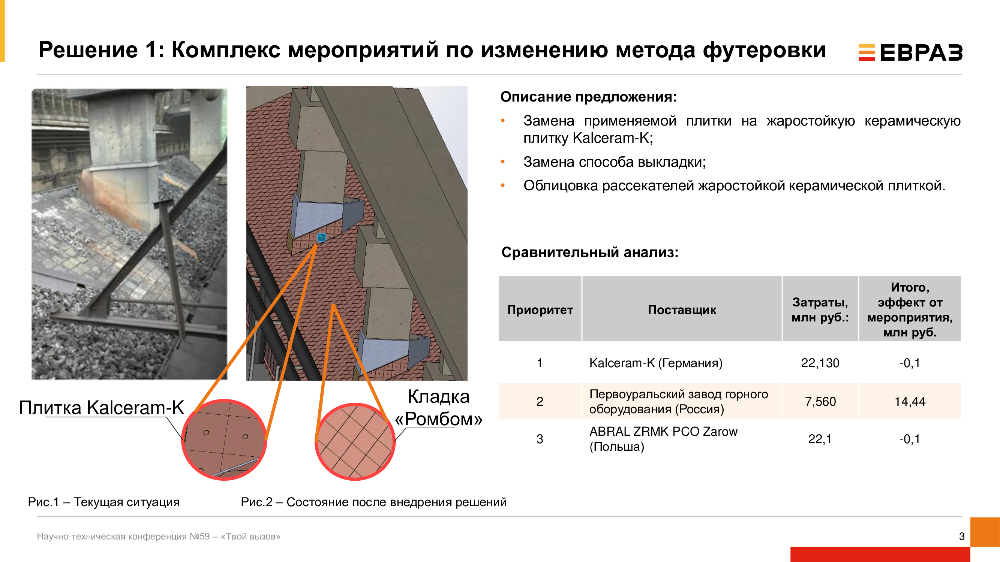

### Решение 1 Моделирование
**Мой вклад** - 3D модель, CFD-анализ, анимация, дизайн слайда
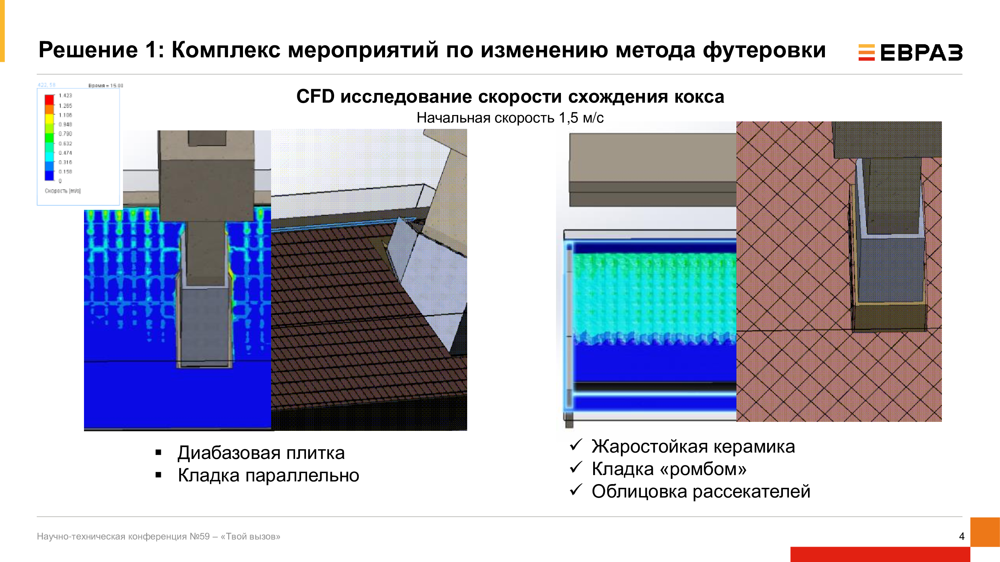
**анимация**

*1*

*2*

## Решение 2
**Мой вклад** - 3D модель, дизайн слайда
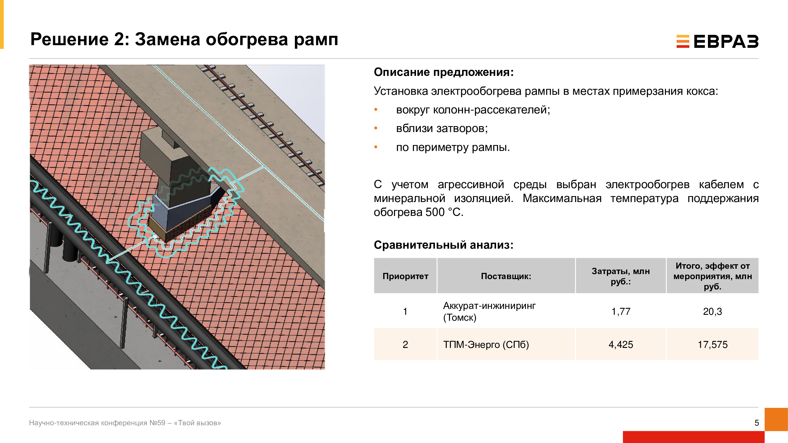

### Решение 2 Моделирование
**Мой вклад** - 3D модель, Тепловой анализ, анимация, дизайн слайда
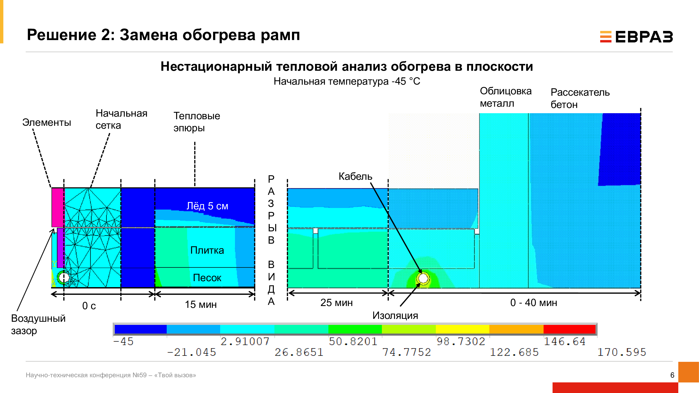
**анимация**
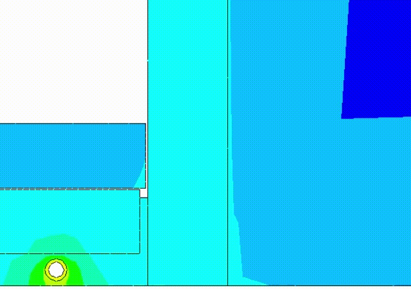

## Решение 3
**Мой вклад** - 3D модель, дизайн слайда
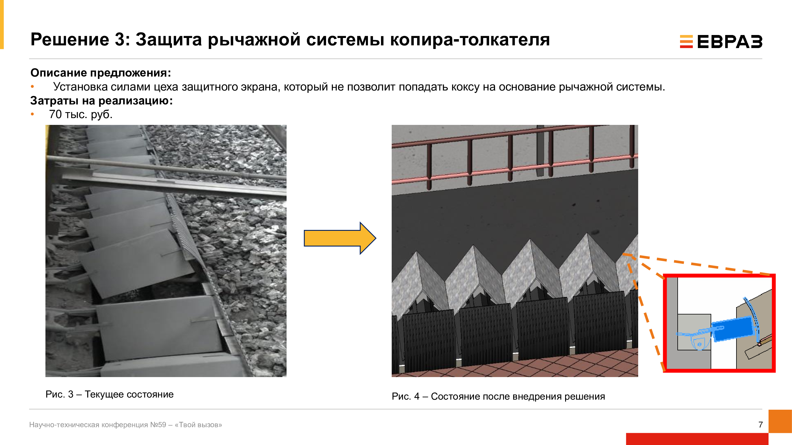

## Решение 4
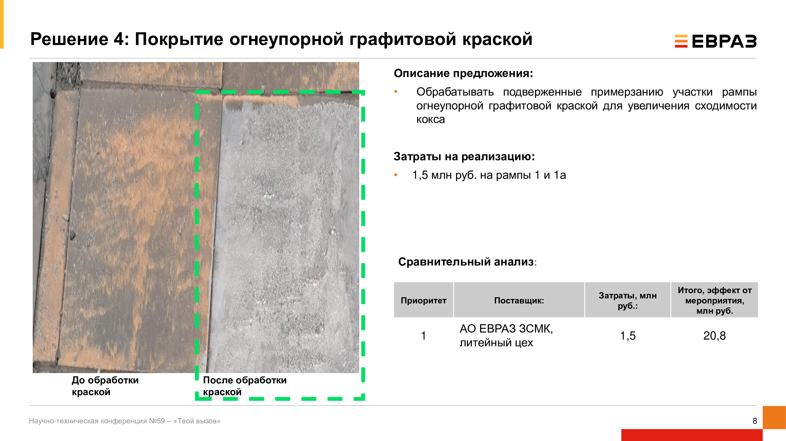

## Решение 5
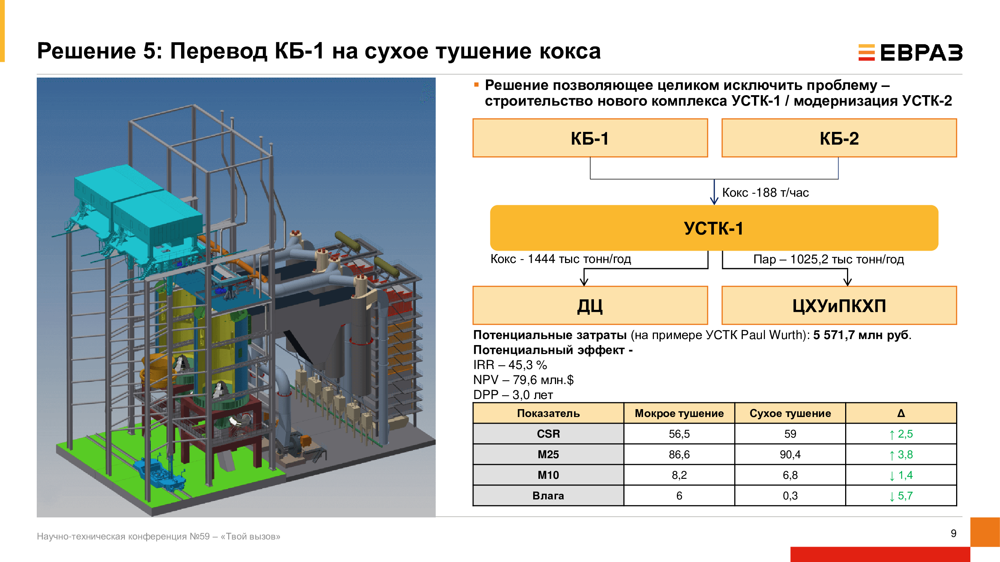

## Authors

**Команда**
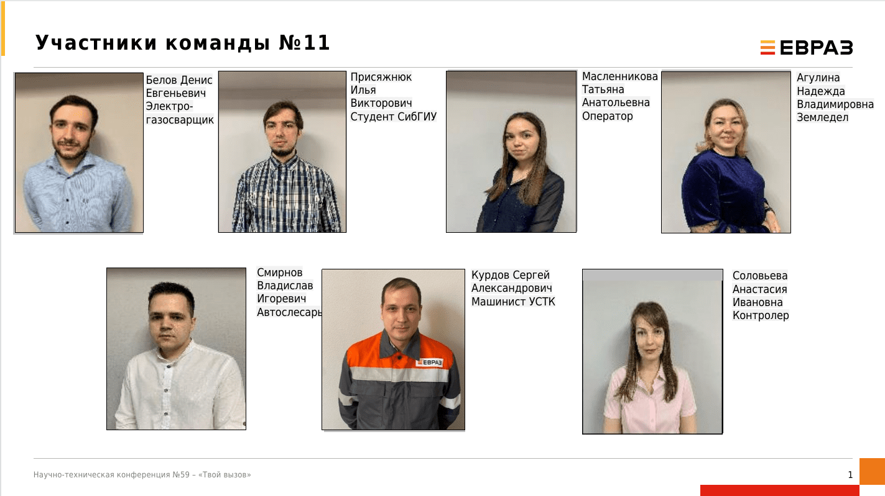

* **Elijah Pris** - *Студент Бакалавриат "Промышленная электроника"* - [Elijah Pris](https://github.com/Elijah-Prisyazhnyuk) - *Презентация с конференции*

## Acknowledgements

* [ElijahPris](https://github.com/Elijah-Prisyazhnyuk)
